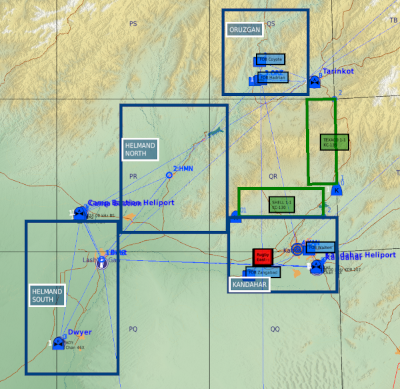

# DCS Afghanistan map sandbox mission
This is a sandbox mission encompassing the entire Afghanistan map with multiple client slots, tankers, and tasks generated via the F10 communications menu.

## Features Overview
* 7 areas of operations (AOs)
* On-demand CAS tasks with AI voiceovers via the F10 menu
* On-demand strike tasks via the F10 menu
* On-demand troop transport tasks
* Dynamic cargo
* Supercarrier with Airboss script for cyclic operations
* Tankers for aerial refueling
* Kneeboards with comms plan, waypoints, and navaids
* Forward operating bases and outposts (templates by PeneCruz)
* AI traffic for ambiance

